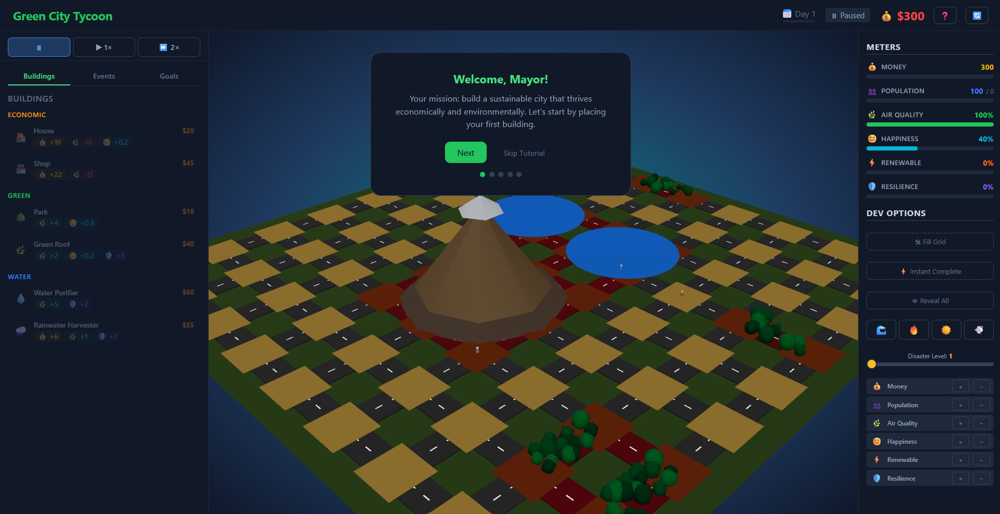
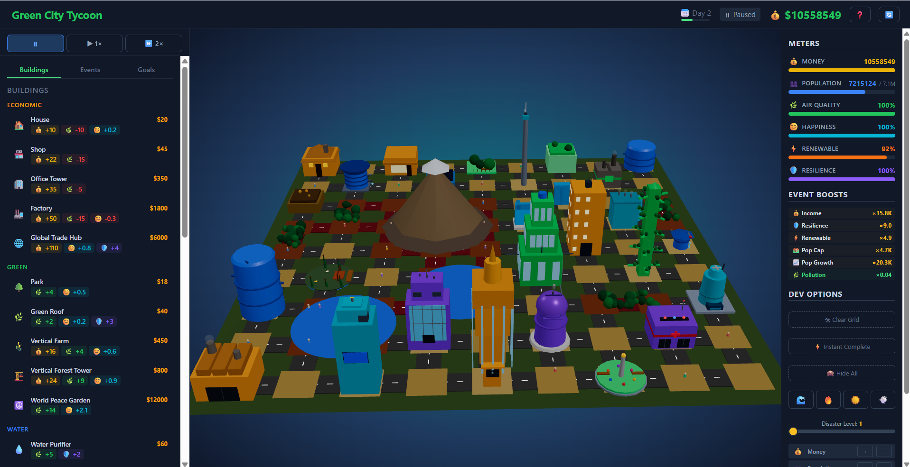
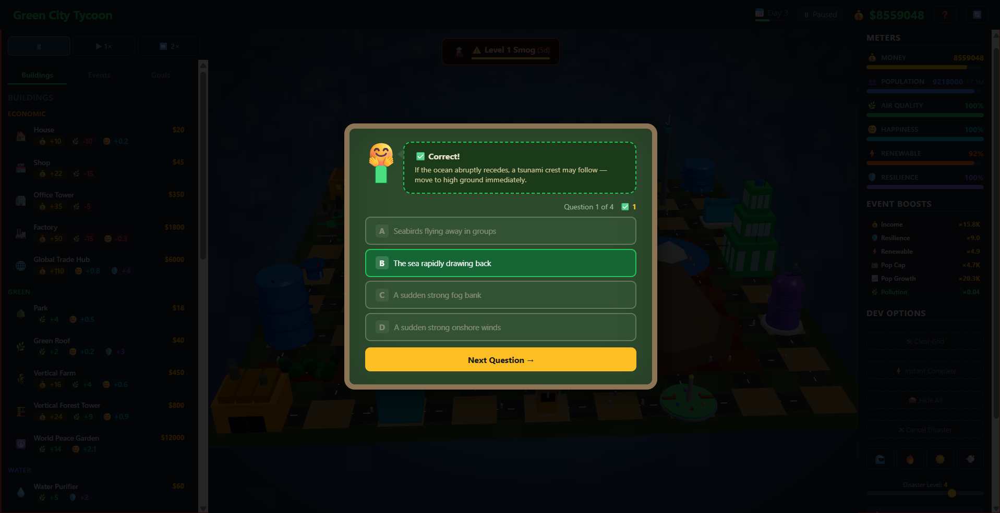
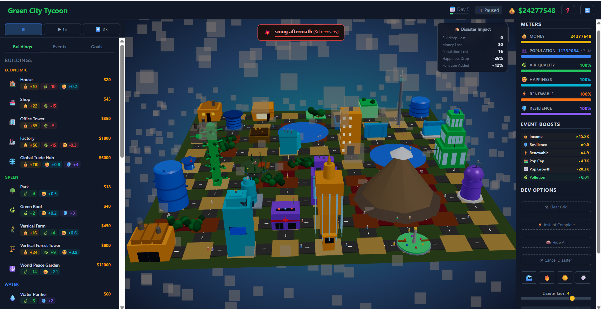

# Green City Tycoon

A sustainability-themed city management simulation built with React and Three.js. Players plan and grow a green city on a 9×9 grid, balancing economic growth against pollution, renewable energy adoption, and citizen happiness.

**[Live Demo](https://green-city-tycoon-nine.vercel.app/)** | **[GitHub](https://github.com/marcolo0714-lgtm/Green-City-Tycoon)**

## Screenshots


*Game layout: top status bar, left building menu, center 3D grid, right meter panel.*


*All buildings unlocked and placed on the grid showing the full city layout.*


*Disaster defense educational minigame: 4-question quiz with teacher character and damage reduction scoring.*


*Smog disaster aftermath showing the damage report box during the 3-day recovery phase.*

## Game Overview

Place 30 unique buildings across 6 categories — Economic, Green, Water, Energy, Coastal, and Science — each with its own 3D model. Organize 10 city-wide events that unlock new buildings and provide permanent compounding stat multipliers. Defend against tsunamis, earthquakes, droughts, and smog through educational quiz-based minigames and strategic building placement.

Six real-time meters track city performance: **Money**, **Population**, **Pollution**, **Happiness**, **Renewable Energy**, and **Resilience**. Building adjacency synergies reward thoughtful urban planning — placing a Park next to a House boosts happiness, while a Factory next to a Park diminishes it.

## Features

- **30 buildings** with unique 3D models, all four-side decorated
- **10 progression events** with permanent multiplicative stat multipliers
- **4 disaster types** (tsunami, earthquake, drought, smog) with 3D visual effects
- **Educational minigame** — 110 quiz questions across 5 categories, 10–70% damage reduction
- **Building adjacency synergies** — 9 pair types with per-day happiness bonuses or penalties
- **Streak-based penalties** for prolonged pollution and overcrowding
- **Persistent meter accumulation** — happiness and penalties compound over time
- **Terrain blocks** (mountain, lake, forest) with clearing costs
- **Tutorial walkthrough** and mobile-responsive layout
- **Game state persistence** — progress saved to browser and restored on reload
- **Achievement objectives** with 20 goals

## Tech Stack

| Layer | Technology |
|---|---|
| Framework | React 19 + TypeScript 6 |
| Build | Vite 8 |
| 3D Rendering | Three.js + React Three Fiber + Drei |
| State Management | Zustand 5 |
| Linting | oxlint |
| Deployment | Vercel |

## Project Structure

```
src/
  components/    16 React components (3D scene, UI panels, overlays)
  store/         Zustand store with all game logic (~1000 lines)
  data/          Building definitions, event definitions, quiz questions
  types/         Full TypeScript type system
  util/          Utility functions
```

## Getting Started

```bash
npm install
npm run dev
```

Open [http://localhost:5173](http://localhost:5173).

## Scripts

| Command | Description |
|---|---|
| `npm run dev` | Start development server |
| `npm run build` | Type-check and production build |
| `npm run preview` | Preview production build |
| `npm run lint` | Run oxlint |

## How to Play

1. Select a building from the left sidebar (affordable buildings are enabled)
2. Click an empty tile on the 3D grid to place it (2-day construction)
3. Organize events from the Events tab to unlock new buildings and gain multipliers
4. Prepare for disasters by completing the educational quiz to reduce damage
5. Plan building adjacencies — positive synergies boost happiness, negative ones hurt it
6. Monitor the six meters on the right panel; keep pollution low and happiness high
7. Drag to pan, scroll to zoom the 3D view
